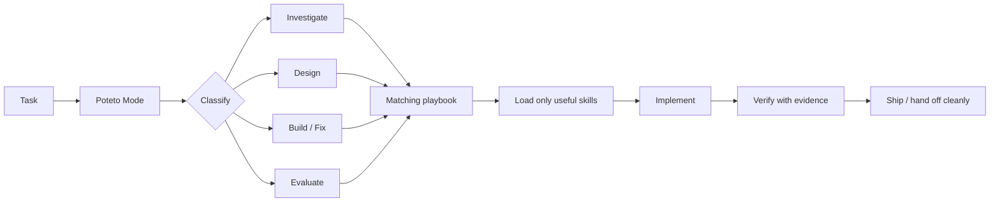

<div align="center">

# 🥔 potetos-for-everyone

### Lauren Tan's pstack engineering workflow, everywhere.

**47 portable Agent Skills · 23 playbooks · one npm install · practically any AI coding agent**

[](https://www.npmjs.com/package/potetos-for-everyone)
[](https://github.com/TheOnlyFusionCube/potetos-for-everyone/actions/workflows/ci.yml)
[](https://nodejs.org/)
[](package.json)
[](LICENSE)

**Cursor · Claude Code · Codex · Gemini · GitHub Copilot · Windsurf · Cline · Roo · Continue · generic `AGENTS.md`**

</div>

> [!IMPORTANT]
> **Credit where it belongs:** [pstack](https://github.com/cursor/plugins/tree/main/pstack) and **Poteto Mode** were created by **Lauren Tan ([@poteto](https://github.com/poteto))**. `potetos-for-everyone` is an independent portability-focused adaptation, not an official Lauren Tan or Cursor project. The original MIT notice is preserved in [LICENSE](LICENSE) and [NOTICE.md](NOTICE.md).

---

## Install. Prompt. Ship.

From the repo where you want Poteto Mode:

```bash
npm install --save-dev potetos-for-everyone
```

Then tell your coding agent:

```text
Use poteto-mode.
```

**That's it.** The npm package has **zero npm dependencies** and automatically installs the portable skills, agent shims, and `AGENTS.md` fallback into the project.

Prefer no dependency?

```bash
npx --yes potetos-for-everyone install
```

Prefer a global CLI?

```bash
npm install --global potetos-for-everyone
potetos install
```

<details>
<summary><strong>Non-npm fallback</strong></summary>

macOS / Linux:

```bash
curl -fsSL https://raw.githubusercontent.com/TheOnlyFusionCube/potetos-for-everyone/main/install.sh | sh
```

PowerShell:

```powershell
irm https://raw.githubusercontent.com/TheOnlyFusionCube/potetos-for-everyone/main/install.ps1 | iex
```

</details>

---

## What this gives your agent

`potetos-for-everyone` ports pstack's engineering discipline away from a single host runtime and into one canonical, capability-driven skill tree.

| Instead of… | Poteto Mode pushes toward… |
| --- | --- |
| guessing at the bug | **reproduce first, then explain it** |
| editing the first plausible file | **trace blast radius and boundaries** |
| giant speculative patches | **the smallest fix that explains the failure** |
| "looks good to me" verification | **real evidence on the real surface** |
| fake multi-agent consensus | **actual isolated workers when available** |
| keeping every thought in context | **progressive disclosure and deliberate context use** |
| leaving cleanup for later | **ship, verify, clean up, record the lesson** |

### The workflow



---

## Works across agents

There is **one canonical behavior tree** under [`skills/`](skills/). Agent adapters are thin shims, not divergent copies of the workflow.

| Agent / host | Installed integration |
| --- | --- |
| Cursor | `.cursor/rules/potetos-for-everyone.mdc` |
| Claude Code | `CLAUDE.md` |
| OpenAI Codex | `AGENTS.md` |
| Gemini | `GEMINI.md` |
| GitHub Copilot | `.github/copilot-instructions.md` |
| Windsurf | `.windsurf/rules/potetos-for-everyone.md` |
| Cline | `.clinerules/potetos-for-everyone.md` |
| Roo | `.roo/rules/potetos-for-everyone.md` |
| Continue | `.continue/rules/potetos-for-everyone.md` |
| Everything else | portable `AGENTS.md` fallback |

Canonical skills ask for capabilities, not vendor-specific APIs: repository I/O, command execution, VCS/history, search, observation, task tracking, and isolated delegation when the host can genuinely provide it. See [PORTABILITY.md](PORTABILITY.md).

> [!NOTE]
> Missing capabilities degrade **explicitly**. A sequential self-review is not presented as an independent reviewer, static inspection is not presented as runtime proof, and a proxy artifact is not presented as the real thing.

---

## What's inside

<table>
<tr>
<td width="33%" valign="top">

### 🧭 Understand

- `poteto-mode`
- `how`
- `why`
- `recall`
- `blast-radius`
- `investigation`
- runtime / trace forensics

</td>
<td width="33%" valign="top">

### 🛠️ Build

- architecture
- features
- bug fixes
- refactors
- prototypes
- TDD
- TypeScript discipline
- visual parity

</td>
<td width="33%" valign="top">

### ✅ Prove & ship

- evals
- adversarial review
- verification skills
- PR babysitting
- autonomous runs
- orchestration
- cleanup & shipping

</td>
</tr>
</table>

The tracked pstack-style inventory is **47 canonical Agent Skills** and **23 Poteto Mode playbooks**. The portable [guide](docs/guide/README.md) follows the setup → understand → design → build → verify → autonomous-work learning path.

There is also an optional [`automations/benny`](automations/benny/README.md) pack for portable issue triage and reproduce/fix automation. It stays dormant until a host provides triggers and credentials.

---

## Designed to be low-friction *and* safe

The installer is intentionally conservative around your repo:

- **Automatic project setup** on normal local `npm install`.
- **Idempotent updates** when you reinstall or upgrade.
- **No silent overwrite** of locally edited managed skills.
- **Collision detection before copying**, so a real conflict does not leave a half-installed project.
- **Coexists with unrelated Agent Skills** in `.agents/skills/`.
- **Preserves existing instruction files** and manages only its marked blocks.
- **Fresh-clone adoption** when committed Poteto files already match exactly.
- **LF / CRLF tolerant** integrity checks for cross-platform clones.
- **Safe uninstall** that removes only Poteto-managed content.

Skip automatic setup when you want manual control:

```bash
POTETOS_SKIP_AUTO_INSTALL=1 npm install --save-dev potetos-for-everyone
npx potetos install --agent claude
```

---

## CLI

```text
potetos install      install managed skills and agent shims
potetos update       safely refresh an existing install
potetos status       verify managed files are intact
potetos list         show available canonical skills
potetos doctor       inspect environment and adapter discovery
potetos uninstall    remove only managed files / blocks
potetos delegate     run one configured external agent
potetos panel        fan out to configured external agents
```

Both command names are available:

```bash
potetos --help
potetos-for-everyone --help
```

Node.js **18+** is enough for install/update/status/uninstall. Python **3.10+** is only needed for the optional external-agent `delegate` / `panel` runner.

---

## Real parallel workers when your host has no subagents

Native subagents are preferred. If the host has none, the optional runner can fan out to **user-configured AI-agent CLIs** and put each worker into its own Git worktree:

```bash
python3 bin/potetos panel \
  --workspace . \
  --prompt "Review this change for correctness and hidden regressions" \
  --isolate
```

`--isolate` means separate worktree + branch per worker, so "parallel review" is actually independent filesystem state rather than several prompts trampling the same checkout. See [runtime/README.md](runtime/README.md).

---

## Update / remove

```bash
npm install --save-dev potetos-for-everyone@latest
npx potetos status
```

Managed skills are integrity-checked first. If you intentionally want to discard edits to managed files:

```bash
npx potetos update --force
```

For a clean removal:

```bash
npx potetos uninstall
npm uninstall potetos-for-everyone
```

Run the Poteto uninstall before removing the npm package if you want generated skills/shims cleaned up too; npm does not provide a dependency-uninstall lifecycle hook that can safely do this after package removal.

---

## Contributing & verification

Clone the repo and run:

```bash
python3 scripts/verify.py
python3 scripts/publish_check.py
npm test --if-present
npm run check:pack
```

For local development on the skill pack itself, link it into another project so edits are reflected immediately:

```bash
git clone https://github.com/TheOnlyFusionCube/potetos-for-everyone.git
python3 potetos-for-everyone/bin/potetos install \
  --target /path/to/project \
  --link \
  --agent universal
```

See [CONTRIBUTING.md](CONTRIBUTING.md) and [PUBLISHING.md](PUBLISHING.md).

---

## Upstream & credit

This adaptation currently tracks [`cursor/plugins/pstack` at `d7cde2b`](https://github.com/cursor/plugins/commit/d7cde2b84eadbcd6fd890302c876f4436ccb6d82).

It is **not a byte-for-byte mirror**. Host-specific mechanics are rewritten against the portability contract while preserving the workflow architecture, useful public skill names, engineering intent, and attribution.

### Thank you, Lauren

**pstack and Poteto Mode are Lauren Tan's work.** This repository exists to make that workflow usable in more agent environments while keeping the origin unmistakable.

- Original project: [Cursor plugins → pstack](https://github.com/cursor/plugins/tree/main/pstack)
- Creator: **Lauren Tan ([@poteto](https://github.com/poteto))**
- Upstream license: MIT
- Adaptation provenance: [NOTICE.md](NOTICE.md) · [UPSTREAM.json](UPSTREAM.json) · [UPSTREAM_INVENTORY.json](UPSTREAM_INVENTORY.json)

## License

MIT. Portions adapted from pstack retain **Copyright (c) 2026 Lauren Tan**. See [LICENSE](LICENSE) and [NOTICE.md](NOTICE.md).
