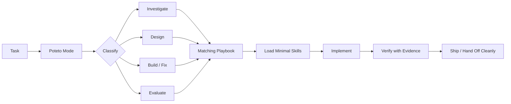

<div align="center">


# 🥔 potetos-for-everyone
### Lauren Tan's pstack & Poteto Mode Engineering Workflow for Any AI Coding Agent

**47 Portable Agent Skills · 23 Rigorous Playbooks · 23 Core Principles · Zero Dependencies · One-Command Setup**

[](https://www.npmjs.com/package/potetos-for-everyone)
[](https://github.com/TheOnlyFusionCube/potetos-for-everyone/actions/workflows/ci.yml)
[](https://nodejs.org/)
[](package.json)
[](LICENSE)
[](https://github.com/TheOnlyFusionCube/potetos-for-everyone/stargazers)

**Cursor · Claude Code · OpenAI Codex · Google Gemini · GitHub Copilot · Windsurf · Cline · Roo Code · Continue · generic `AGENTS.md`**

</div>

> **`potetos-for-everyone`** ports [Lauren Tan's](https://github.com/poteto) renowned **pstack** and **Poteto Mode** engineering workflow into a universal, zero-dependency skill tree that works across practically every modern AI coding agent. It brings disciplined software engineering—reproduce first, minimal blast radius, TDD, behavioral verification, and true parallel worktree execution—to Cursor, Claude Code, Codex, Gemini, Windsurf, Copilot, and more.

> [!IMPORTANT]
> **Credit where it belongs:** [pstack](https://github.com/cursor/plugins/tree/main/pstack) and **Poteto Mode** were created by **Lauren Tan ([@poteto](https://github.com/poteto))**. `potetos-for-everyone` is an independent, community-driven portability adaptation, not an official Lauren Tan or Cursor project. Upstream MIT notice and attribution are preserved in [LICENSE](LICENSE) and [NOTICE.md](NOTICE.md).

---

## Quick Start (Zero Friction)

### 1. Install

Pick the method that matches your existing developer workflow:

#### Option A: Zero setup / one-command (recommended)
Installs or updates skills directly into the current repository without adding a package dependency:

```bash
npx potetos
```
*(or `npx potetos-for-everyone`)*

#### Option B: Project dev dependency (npm / pnpm / bun / yarn)
Automatically installs and updates skills via `postinstall` into your project's `.agents/skills`:

```bash
npm install --save-dev potetos-for-everyone
# or: pnpm add -D potetos-for-everyone
# or: bun add -d potetos-for-everyone
# or: yarn add -D potetos-for-everyone
```

#### Option C: Global CLI
```bash
npm install --global potetos-for-everyone
potetos install
```

<details>
<summary><strong>Non-npm standalone installer (curl / PowerShell)</strong></summary>

No Node or npm required. Detects Node, Bun, Python, or runs native POSIX shell / PowerShell:

macOS / Linux:

```bash
curl -fsSL https://raw.githubusercontent.com/TheOnlyFusionCube/potetos-for-everyone/main/install.sh | sh
```

PowerShell (Windows):

```powershell
irm https://raw.githubusercontent.com/TheOnlyFusionCube/potetos-for-everyone/main/install.ps1 | iex
```

</details>

### 2. Prompt

Tell your coding agent:

```text
Use poteto-mode.
```

**That's it.** The package has **zero runtime dependencies** and automatically configures canonical skills, agent shims, and an `AGENTS.md` fallback into your repository.

---

## What This Gives Your Agent

`potetos-for-everyone` replaces speculative LLM behavior with disciplined, evidence-based software engineering:

| Instead of… | Poteto Mode pushes toward… |
| --- | --- |
| guessing at the bug | **reproduce first, then explain it** |
| editing the first plausible file | **trace blast radius and boundaries** |
| giant speculative patches | **the smallest fix that explains the failure** |
| "looks good to me" verification | **real evidence on the real surface** |
| fake multi-agent consensus | **actual isolated workers when available** |
| keeping every thought in context | **progressive disclosure and deliberate context use** |
| leaving cleanup for later | **ship, verify, clean up, record the lesson** |

### The Workflow



---

## Works Across Agents

There is **one canonical behavior tree** under [`skills/`](skills/). Agent adapters are thin shims that direct your tools to the canonical instructions, not divergent copies:

| Agent / Host | Config File Installed | Skill Path | Supported Capabilities |
| :--- | :--- | :--- | :--- |
| **Cursor** | `.cursor/rules/potetos-for-everyone.mdc` | `.agents/skills` | Rules, Native Commands, Subagents |
| **Claude Code** | `CLAUDE.md` | `.agents/skills` | Slash Commands, Tool Calling, Worktrees |
| **OpenAI Codex** | `AGENTS.md` | `.agents/skills` | Native AGENTS.md, Sandboxed Shell |
| **Google Gemini** | `GEMINI.md` | `.agents/skills` | Model Instructions, Context Windows |
| **GitHub Copilot** | `.github/copilot-instructions.md` | `.agents/skills` | Copilot Workspace & VS Code Chat |
| **Windsurf** | `.windsurf/rules/potetos-for-everyone.md` | `.agents/skills` | Cascade Rules & Flow Memory |
| **Cline** | `.clinerules/potetos-for-everyone.md` | `.agents/skills` | Autonomous Tasks & Custom Instructions |
| **Roo Code** | `.roo/rules/potetos-for-everyone.md` | `.agents/skills` | Role-specific Prompt Rules |
| **Continue** | `.continue/rules/potetos-for-everyone.md` | `.agents/skills` | Context Providers & Instructions |
| **Universal / Generic** | `AGENTS.md` | `.agents/skills` | Open Agent Skills Specification |

See [PORTABILITY.md](PORTABILITY.md) for detailed capability fallbacks.

---

## Complete Playbooks Directory (23 Playbooks)

Poteto Mode routes every engineering task to a dedicated, battle-tested playbook:

| Playbook | Description & Trigger | Primary Action |
| :--- | :--- | :--- |
| [`investigation`](skills/poteto-mode/playbooks/investigation.md) | Read-only investigation without making code edits. | Reproduce symptom, trace causality, explain mechanism |
| [`bug-fix`](skills/poteto-mode/playbooks/bug-fix.md) | Defect remediation. | Reproduce first, identify root mechanism, write smallest fix |
| [`perf-issue`](skills/poteto-mode/playbooks/perf-issue.md) | Performance bottlenecks and latency regressions. | Profile, isolate bottleneck, verify speedup with data |
| [`hillclimb`](skills/poteto-mode/playbooks/hillclimb.md) | Metric hillclimb and benchmark optimization. | Iterative scoring against an evaluation harness |
| [`runtime-forensics`](skills/poteto-mode/playbooks/runtime-forensics.md) | Live execution anomalies. | Inspect memory, process state, and live socket behavior |
| [`trace-forensics`](skills/poteto-mode/playbooks/trace-forensics.md) | Distributed traces and telemetry spans. | Analyze OpenTelemetry spans, request IDs, and trace logs |
| [`feature`](skills/poteto-mode/playbooks/feature.md) | New feature or capability development. | Data modeling, boundary design, behavioral test, implementation |
| [`refactoring`](skills/poteto-mode/playbooks/refactoring.md) | Code refactoring and technical debt reduction. | Structural reorganization without behavioral drift |
| [`prototype`](skills/poteto-mode/playbooks/prototype.md) | Rapid experimental prototyping. | Cheap throwaways to empirically answer design questions |
| [`visual-parity`](skills/poteto-mode/playbooks/visual-parity.md) | Visual styling and UI parity. | Screenshot comparisons and pixel-level regression checks |
| [`authoring-a-skill`](skills/poteto-mode/playbooks/authoring-a-skill.md) | Authoring reusable Agent Skills. | Encapsulate domain workflows following the Agent Skills spec |
| [`eval`](skills/poteto-mode/playbooks/eval.md) | Evaluating skills, prompts, and models. | Quantitative evaluation against expected criteria |
| [`babysit`](skills/poteto-mode/playbooks/babysit.md) | Driving PRs through review and CI. | Monitor CI checks, resolve comments, merge cleanly |
| [`shipping`](skills/poteto-mode/playbooks/shipping.md) | Release engineering and publishing. | Pre-landing verification, version bump, changelog update |
| [`autonomous-run`](skills/poteto-mode/playbooks/autonomous-run.md) | Long-running and overnight tasks. | Durable decision checkpoints and serialized progress logs |
| [`orchestrate`](skills/poteto-mode/playbooks/orchestrate.md) | Large multi-agent engineering programs. | Partition scope, sequence dependencies, track milestones |
| [`autopilot-full`](skills/poteto-mode/playbooks/autopilot-full.md) | Independent PR autopilot. | End-to-end autonomous implementation from issue to clean PR |
| [`autopilot-stack`](skills/poteto-mode/playbooks/autopilot-stack.md) | Stacked pull request autopilot. | Ordered series of small, reviewable dependent branches |
| [`session-pickup`](skills/poteto-mode/playbooks/session-pickup.md) | Resuming in-flight work. | Rehydrate context safely across resets without hallucinating |
| [`pause-safely`](skills/poteto-mode/playbooks/pause-safely.md) | Cleanly suspending active tasks. | Save reproducible state and evidence notes for later resumption |
| [`multi-phase-plan`](skills/poteto-mode/playbooks/multi-phase-plan.md) | Multi-phase architectural migrations. | Break massive migrations into phased, verifiable increments |
| [`worktree-cleanup`](skills/poteto-mode/playbooks/worktree-cleanup.md) | Disk reclamation. | Safety-gated pruning of merged worktrees and stale artifacts |
| [`opening-a-pr`](skills/poteto-mode/playbooks/opening-a-pr.md) | Preparing and opening pull requests. | Conventional commit squashing, test summaries, concise briefings |

---

## Core Principles Directory (23 Principles)

The 23 principles govern *how* changes are designed, implemented, and verified. Load a principle when its rule changes a concrete decision:

| Principle | Core Rule |
| :--- | :--- |
| [`laziness-protocol`](skills/principle-laziness-protocol/SKILL.md) | Bias toward deletion and the smallest change that fully solves the problem. |
| [`foundational-thinking`](skills/principle-foundational-thinking/SKILL.md) | Choose core data structures, ownership, and sequencing before writing logic. |
| [`redesign-from-first-principles`](skills/principle-redesign-from-first-principles/SKILL.md) | Design the ideal architecture as if from day one, then migrate toward it. |
| [`attack-the-premise`](skills/principle-attack-the-premise/SKILL.md) | Challenge shared assumptions when repeated fixes fail the same gate. |
| [`subtract-before-you-add`](skills/principle-subtract-before-you-add/SKILL.md) | Remove dead weight and obsolete paths before adding new logic. |
| [`minimize-reader-load`](skills/principle-minimize-reader-load/SKILL.md) | Reduce indirection, mutable scope, and single-caller abstractions. |
| [`outcome-oriented-execution`](skills/principle-outcome-oriented-execution/SKILL.md) | Converge on the target architecture rather than preserving temporary shims. |
| [`experience-first`](skills/principle-experience-first/SKILL.md) | Optimize for end-user delight over developer implementation convenience. |
| [`exhaust-the-design-space`](skills/principle-exhaust-the-design-space/SKILL.md) | Build competing cheap prototypes and compare evidence before committing. |
| [`build-the-lever`](skills/principle-build-the-lever/SKILL.md) | Prefer a script, generator, or benchmark over repetitive manual edits. |
| [`model-the-domain`](skills/principle-model-the-domain/SKILL.md) | Encode business rules in state machines, typed models, and clear boundaries. |
| [`boundary-discipline`](skills/principle-boundary-discipline/SKILL.md) | Validate and normalize at edges, trust internal invariants. |
| [`type-system-discipline`](skills/principle-type-system-discipline/SKILL.md) | Make invalid states unrepresentable and parse primitives into rich types. |
| [`make-operations-idempotent`](skills/principle-make-operations-idempotent/SKILL.md) | Design repeated operations to converge on the same correct end state. |
| [`migrate-callers-then-delete-legacy-apis`](skills/principle-migrate-callers-then-delete-legacy-apis/SKILL.md) | Update all callers and delete old paths in the same migration wave. |
| [`separate-before-serializing-shared-state`](skills/principle-separate-before-serializing-shared-state/SKILL.md) | Partition ownership before adding locks, queues, or synchronization. |
| [`prove-it-works`](skills/principle-prove-it-works/SKILL.md) | Verify behavior against the real runtime artifact; never rely on proxy assumptions. |
| [`fix-root-causes`](skills/principle-fix-root-causes/SKILL.md) | Trace symptoms to the single root mechanism and fix it, not downstream effects. |
| [`sequence-verifiable-units`](skills/principle-sequence-verifiable-units/SKILL.md) | Break work into small units that each conclude with proof. |
| [`test-behavior-not-implementation`](skills/principle-test-behavior-not-implementation/SKILL.md) | Assert observable outcomes from the consumer's seat; avoid mock mirrors. |
| [`guard-the-context-window`](skills/principle-guard-the-context-window/SKILL.md) | Delegate bulk exploration to subagents or files to keep main context lean. |
| [`never-block-on-the-human`](skills/principle-never-block-on-the-human/SKILL.md) | Execute reversible work autonomously; ask only for irreversible decisions. |
| [`encode-lessons-in-structure`](skills/principle-encode-lessons-in-structure/SKILL.md) | Turn recurring human corrections into linters, types, tests, or skills. |

---

## Real Parallel Workers (Git Worktree Isolation)

Native subagents are preferred when available. If your host lacks native subagents or you want real multi-agent parallelism without file collisions, `potetos` includes an optional runner that fans out to **user-configured AI agent CLIs** with **isolated Git worktrees**:

```bash
python3 bin/potetos panel \
  --workspace . \
  --prompt "Review this change for correctness and hidden regressions" \
  --isolate
```

`--isolate` provisions an isolated Git branch and worktree per worker. Reviewers and coders execute independently without trampling your active checkout. See [runtime/README.md](runtime/README.md).

---

## CLI Reference

```text
npx potetos          auto-install or refresh managed skills
potetos install      install managed skills and agent shims
potetos update       safely refresh an existing install without clobbering edits
potetos status       verify managed files are intact and clean
potetos list         list available canonical skills
potetos doctor       inspect environment, node/python runtime, and adapter status
potetos uninstall    remove only managed files and instruction blocks
potetos delegate     run one external agent worker in an isolated worktree
potetos panel        fan out prompt across configured external agent runners
```

Both binary aliases are available: `potetos` and `potetos-for-everyone`.

---

## Frequently Asked Questions (FAQ)

### What is Poteto Mode?
**Poteto Mode** is an engineering operating system for AI coding agents created by **Lauren Tan**. Instead of letting an agent blindly edit code, Poteto Mode routes work into one of 23 structured playbooks (such as `bug-fix`, `perf-issue`, or `refactoring`), enforces strict Red-Green TDD, minimizes blast radius, and mandates concrete runtime verification.

### How does `potetos-for-everyone` differ from upstream Cursor pstack?
Upstream `cursor/plugins/pstack` is tightly integrated with Cursor's proprietary plugin format. `potetos-for-everyone` is a **zero-dependency, capability-driven distribution** that makes the same canonical skills and playbooks usable across **Claude Code, OpenAI Codex, Google Gemini, GitHub Copilot, Windsurf, Cline, Roo Code**, and custom environments. It introduces zero-dependency npm and shell installers, automated updater mechanics, and worktree isolation for hosts without native subagents.

### How do I use this with Claude Code?
Run `npx potetos` inside your repository. It automatically generates `CLAUDE.md` and copies the canonical skill tree into `.agents/skills/`. You can immediately start prompts in Claude Code with `Use poteto-mode`.

### Does this add runtime dependencies to my production application?
**No.** `potetos-for-everyone` has **zero runtime npm dependencies**. It only installs markdown instructions and configuration shims into your development environment (`.agents/skills/`).

### How do I update to the latest upstream pstack updates?
Run `npx potetos update` (or `npm install --save-dev potetos-for-everyone@latest`). If you haven't manually edited managed skills, it refreshes your installation idempotently.

---

## Upstream & Credit

This adaptation currently tracks [`cursor/plugins/pstack` at `71ed0d1`](https://github.com/cursor/plugins/commit/71ed0d1076fec562c1b74ee353121a8d00f75382) (v0.15.0).

It is **not a byte-for-byte mirror**. Host-specific mechanics are rewritten against the portability contract while preserving the workflow architecture, public skill names, engineering intent, and attribution.

### Thank You, Lauren

**pstack and Poteto Mode are Lauren Tan's work.** This repository exists to make that workflow usable in more agent environments while keeping the origin unmistakable.

- Original project: [Cursor plugins → pstack](https://github.com/cursor/plugins/tree/main/pstack)
- Creator: **Lauren Tan ([@poteto](https://github.com/poteto))**
- Upstream license: MIT
- Adaptation provenance: [NOTICE.md](NOTICE.md) · [UPSTREAM.json](UPSTREAM.json) · [UPSTREAM_INVENTORY.json](UPSTREAM_INVENTORY.json)

## License

MIT. Portions adapted from pstack retain **Copyright (c) 2026 Lauren Tan**. See [LICENSE](LICENSE) and [NOTICE.md](NOTICE.md).

<!-- Schema.org JSON-LD Structured Data for Search Engines -->
<script type="application/ld+json">
{
  "@context": "https://schema.org",
  "@type": "SoftwareApplication",
  "name": "potetos-for-everyone",
  "applicationCategory": "DeveloperApplication",
  "operatingSystem": "Cross-platform (macOS, Linux, Windows)",
  "description": "Lauren Tan's pstack and Poteto Mode engineering workflow made portable across AI coding agents including Cursor, Claude Code, Codex, Gemini, Copilot, and Windsurf.",
  "url": "https://github.com/TheOnlyFusionCube/potetos-for-everyone",
  "license": "https://opensource.org/licenses/MIT",
  "author": {
    "@type": "Person",
    "name": "Lauren Tan",
    "url": "https://github.com/poteto"
  }
}
</script>\n